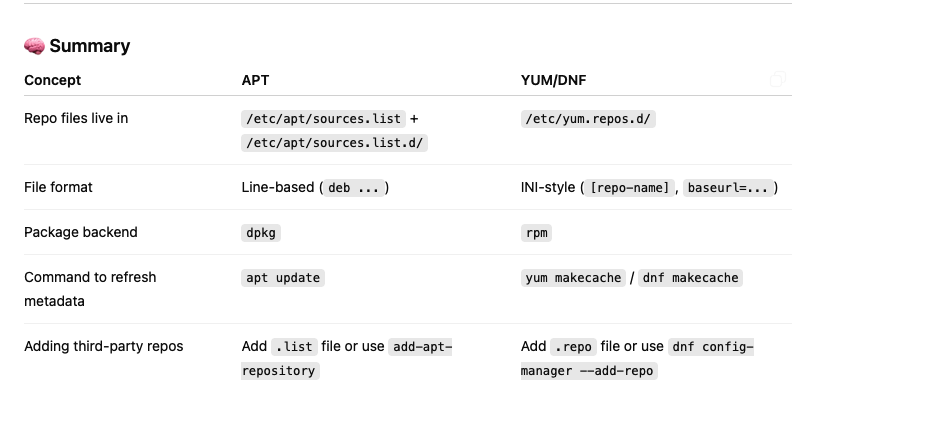

## Package Management

### How APT Knows Where to Go on the Internet

```

Everything APT needs to know is stored in:

/etc/apt/sources.list
/etc/apt/sources.list.d/


Each repository entry tells it:

The URL of the server

The distribution codename (e.g., jammy for Ubuntu 22.04)

The components (e.g., main, universe, restricted)

Example:

deb http://archive.ubuntu.com/ubuntu jammy main restricted universe multiverse

So when you run apt update or apt install, it knows exactly which mirror server to connect to and fetch data from.

```

### Comparison

